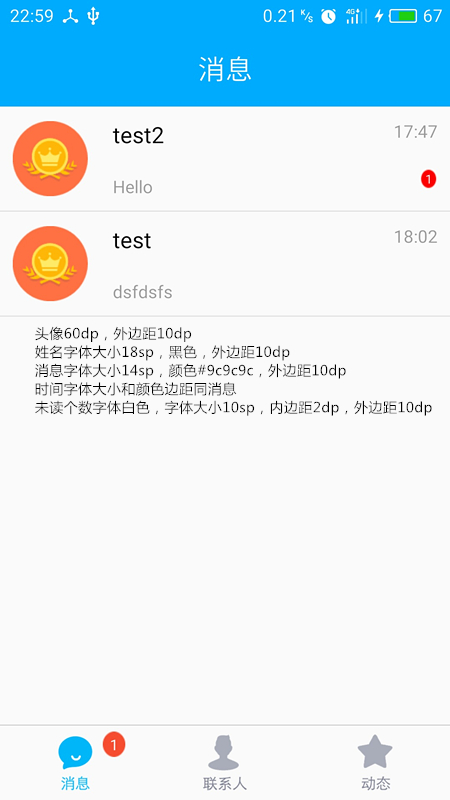

# 环信 #
[官网](http://www.easemob.com/product/cs?utm_source=baidu-pp)

[即时通信云3.x文档](http://docs.easemob.com/im/start)

## Demo使用 ##
测试账号：itheima31(123456) uncleleonfan(123456)

## Demo导入Android Studio ##

## Android SDK的介绍及导入 ##
[官网](http://docs.easemob.com/im/200androidclientintegration/10androidsdkimport)

## Android SDK的基础功能 ##
[官网](http://docs.easemob.com/im/200androidclientintegration/30androidsdkbasics)
### 巨坑 ###
运行出错：Didn't find class "com.hyphenate.chat.adapter.EMACallSession"，原因是hyphenatechat_3.2.0.jar包内没有该类。

解决办法:导入demo里面的hyphenatechat_3.2.0.jar

# Splash界面 #

# 登录界面 #
## IME ##
android:imeOptions="actionNext"
android:imeOptions="actionGo"

# 注册界面 #
## 云数据库 ##
[LeanCloud](https://leancloud.cn/)
[Bmob](http://www.bmob.cn/)

## Android6.0动态权限管理 ##
[介绍](http://www.jianshu.com/p/a37f4827079a)

# 主界面 #

## 底部导航条 ##
RadioGroup, TabHost, FragmentTabHost, 自定义
## 第三方底部条 ##
[BottomBar](https://github.com/roughike/BottomBar)
[AHBottomNavigation](https://github.com/aurelhubert/ahbottomnavigation)
[BottomNavigation](https://github.com/Ashok-Varma/BottomNavigation)
## Fragment的切换 ##

# 联系人 #

## SlideBar ##
### 绘制居中文本 ###
http://www.cnblogs.com/tianzhijiexian/p/4297664.html

## 添加好友 ##
发送好友申请-->好友同意或者拒绝-->好友同意则写入数据库

### 隐藏软键盘 ###

# 聊天界面 #
[通信过程及聊天记录保存](http://docs.easemob.com/im/000quickstart/25communicationandmessagestorage)
## 发送一条消息 ##

### 动画文件 ###
anim文件夹：补间动画

animator文件夹：属性动画

drawable文件夹：帧动画

	<?xml version="1.0" encoding="utf-8"?>
	<animation-list xmlns:android="http://schemas.android.com/apk/res/android">
	    <item android:drawable="@mipmap/loading1" android:duration="100"/>
	    <item android:drawable="@mipmap/loading2" android:duration="100"/>
	    <item android:drawable="@mipmap/loading3" android:duration="100"/>
	    <item android:drawable="@mipmap/loading4" android:duration="100"/>
	    <item android:drawable="@mipmap/loading5" android:duration="100"/>
	    <item android:drawable="@mipmap/loading6" android:duration="100"/>
	    <item android:drawable="@mipmap/loading7" android:duration="100"/>
	    <item android:drawable="@mipmap/loading8" android:duration="100"/>
	</animation-list>

### .9文件制作 ###

## 接收一条消息 ##

## 初始化聊天数据 ##
[官方文档](http://docs.easemob.com/im/200androidclientintegration/50singlechat)

# 会话界面 #

## 会话界面的MVP实现 ##
## ConversationAdapter的实现 ##
## ConverstationItemView的实现 ##
## 点击会话跳转到聊天界面 ##
## 未读消息的更新 ##