# 项目简介 #
本项目是即时通讯的示例项目，使用了MVP模式，集成了环信SDK和Bmob后端云，展示了即时通讯基本的功能的实现，包括注册登录，退出登录，联系人列表，添加好友，删除好友，收发消息，消息提醒等功能。
## 使用的开源项目 ##
* [BottomBar](https://github.com/roughike/BottomBar)
* [EventBus](https://github.com/greenrobot/EventBus)
* [greenDAO](https://github.com/greenrobot/greenDAO)
* [butterknife](https://github.com/JakeWharton/butterknife)

## 学习目标 ##
* 环信SDK的集成与使用
* MVP模式的运用
* ORM数据库的集成与使用
* 模块化思想的运用

# 即时通讯 IM(Instant Messaging)#
>允许两人或多人使用网路即时的传递文字讯息、档案、语音与视频交流。

## 相关产品 ##
* 鼻祖 ICQ
* 国内主流 QQ 微信 陌陌 YY等
* 国外主流 Facebook Messenger WhatsApp Skype Instagram Line

## 第三方服务平台 ##
* [环信](http://www.easemob.com/product/cs?utm_source=baidu-pp)
* [融云](http://www.rongcloud.cn/)
* [网易云信](http://netease.im/)
* [极光IM](https://www.jiguang.cn/im)
* [腾讯云通信IM](https://www.qcloud.com/product/im.html)
* [爱萌](http://www.imsdk.im/)
* [阿里悟空(2016年10月31号正式下线)](http://www.imwukong.com/)
* [阿里百川云旺](http://im.taobao.com/)

# 环信 #
[官网](http://www.easemob.com/product/cs?utm_source=baidu-pp)

[即时通信云3.x文档](http://docs.easemob.com/im/start)

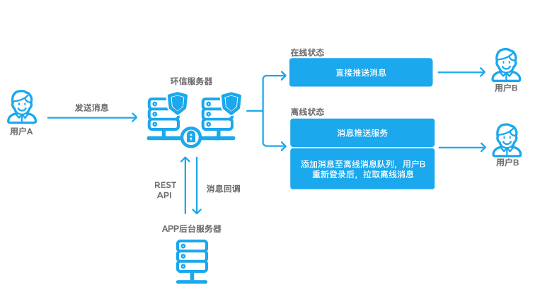

## 环信集成 ##
1. [注册并创建应用](http://docs.easemob.com/im/000quickstart/10register)
2. [下载SDK](http://www.easemob.com/download/im)
3. [SDK的导入](http://docs.easemob.com/im/200androidclientintegration/10androidsdkimport)
4. [SDK的初始化](http://docs.easemob.com/im/200androidclientintegration/30androidsdkbasics)

### .so文件夹 ###
1. 放在jniLibs
2. 也可以放在libs目录下，不过需要在模块下的配置文件中配置
	
		android {
			sourceSets {
		        main {
		            jniLibs.srcDirs = ['libs']
		        }
		    }
		}

### 巨坑 ###
运行出错：Didn't find class "com.hyphenate.chat.adapter.EMACallSession"，原因是hyphenatechat_3.2.0.jar包内没有该类。

解决办法:导入Demo源码中EaseUI库里面的hyphenatechat_3.2.0.jar替换。

# 软件架构 #

## MVC ##

MVC应用于Ruby on Rails, Spring Framework, iOS开发和 ASP.NET等。

* Model: 获取数据的业务逻辑，网络操作，数据库操作
* View: UI
* Controller: 操作Model层获取数据传递给UI

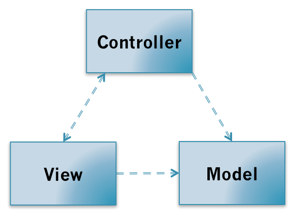

### 服务器端的MVC ###

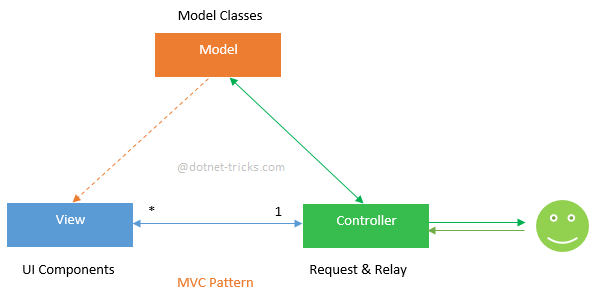

### Android中MVC ###
Android中并没有清晰的MVC框架，如果把Activity当做Controller,根据我们实际开发经验，里面会有大量的UI操作，所以V和C就傻傻分不清了。

* Model:Java Bean, NetworkManager, DataBaseHelper
* View: xml res
* Controller: Activity Fragment
* ArrayList-ListView-Adapter(MVC)

## MVP ##
MVP主要应用于ASP.NET等。**MVP与MVC主要区别是View和Model不再耦合。**

* Model: 获取数据的业务逻辑，网络操作，数据库操作
* View: UI
* Presenter: 操作Model层获取数据传递给UI
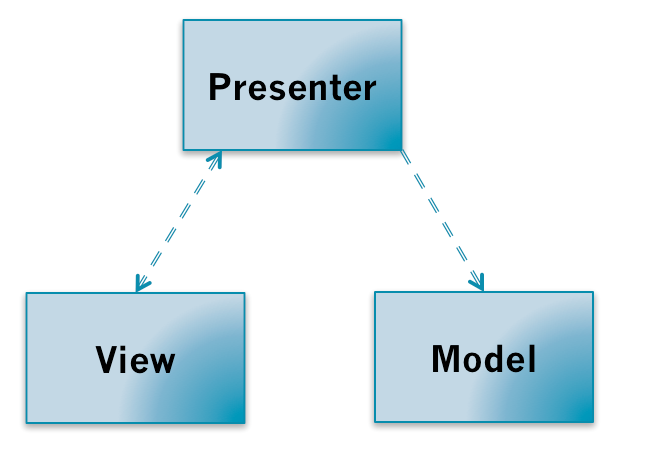

## MVVM ##
MVVM主要应用于WPF, Silverlight, Caliburn, nRoute等。

* Model: 获取数据的业务逻辑，网络操作，数据库操作
* View: UI
* ViewModel: 将View和Model绑定

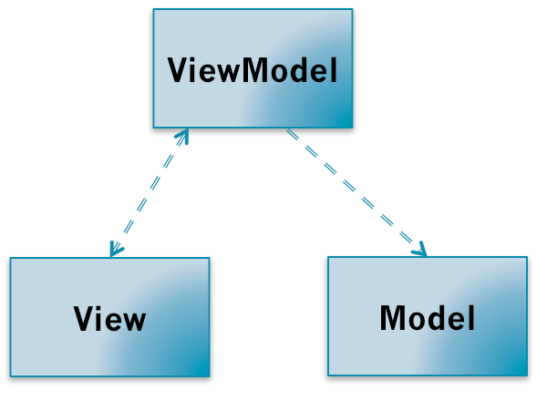

### Android中MVVM ###
[Data Binding Library](https://developer.android.com/topic/libraries/data-binding/index.html)
[中文翻译](http://www.jianshu.com/p/b1df61a4df77)

## 软件架构的核心思想 ##
>分层分模块

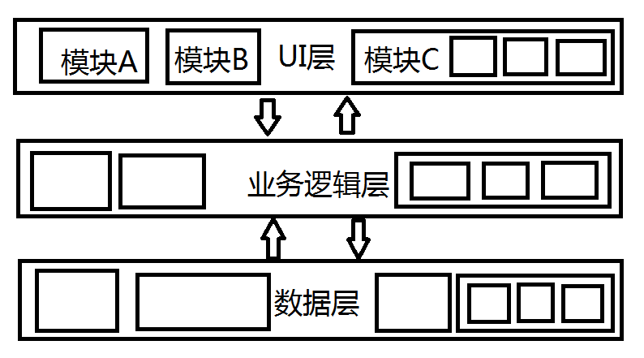

## 参考 ##
[android architecture](https://github.com/googlesamples/android-architecture)

[MVC,MVP和MVVM模式如何选择](http://www.jianshu.com/p/6a86f7fdc0cb)

[Understanding MVC, MVP and MVVM Design Patterns](http://www.dotnettricks.com/learn/designpatterns/understanding-mvc-mvp-and-mvvm-design-patterns)

[教你认清MVC，MVP和MVVM](http://zjutkz.net/2016/04/13/%E9%80%89%E6%8B%A9%E6%81%90%E6%83%A7%E7%97%87%E7%9A%84%E7%A6%8F%E9%9F%B3%EF%BC%81%E6%95%99%E4%BD%A0%E8%AE%A4%E6%B8%85MVC%EF%BC%8CMVP%E5%92%8CMVVM/)

[Android Data Binding](https://github.com/LyndonChin/MasteringAndroidDataBinding)

[Clean Architecture](http://fernandocejas.com/2014/09/03/architecting-android-the-clean-way/)

# 准备好了么？ 开车啦！！！ #
## 包的创建 ##
* adapter 存放适配器
* app 存放常量类，Application类以及一些app层级的全局类
* database 数据库相关类
* event EventBus使用的事件类
* factory 工厂类
* model 数据模型
* presenter MVP模型中的Presenter类
* ui 存放activity和fragment
* utils 工具类
* view MVP模型中的View类
* widget 自定义控件

## 基类的创建 ##
* BaseActivity
* BaseFragment

## Git初始化 ##

# Splash界面 #

## 功能需求 ##
1. 如果没有登录，延时2s, 跳转到登录界面
2. 如果已经登录，则跳转到主界面

## MVP实现 ##
* SplashView
* SplashPresenter

# 登录界面 #
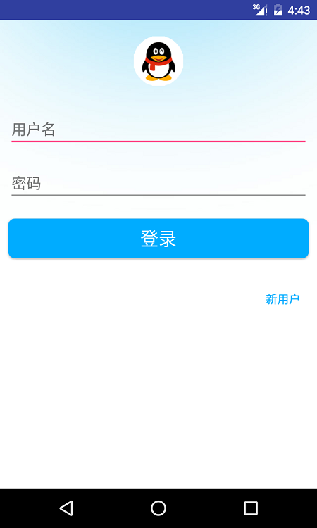

## 功能需求 ##
1. 有两种情况都可以发起登录操作，一是点击登录按钮，而是点击虚拟键盘上的Action键。
2. 点击新用户，跳转到注册界面。

## IME Options##
**注意配置EditText的imeOptions属性时，需要配合inputType才能起作用。**

	android:imeOptions="actionNext"//下一个
	android:imeOptions="actionGo"//启动
	android:imeOptions="actionDone"//完成
	android:imeOptions="actionPrevious"//上一个
	android:imeOptions="actionSearch"//搜索
	android:imeOptions="actionSend"//发送
	
## MVP实现 ##
* LoginView
* LoginPresenter

## EMCallBack的适配器 ##

	public class EMCallBackAdapter implements EMCallBack{
	
	    @Override
	    public void onSuccess() {
	
	    }
	
	    @Override
	    public void onError(int i, String s) {
	
	    }
	
	    @Override
	    public void onProgress(int i, String s) {
	
	    }
	}

## Android6.0动态权限管理 ##
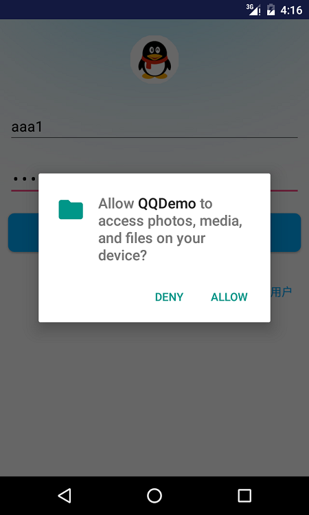

[介绍](http://www.jianshu.com/p/a37f4827079a)

举个栗子：高德地图 百度地图等

    /**
     * 是否有写磁盘权限
     */
    private boolean hasWriteExternalStoragePermission() {
        int result = ActivityCompat.checkSelfPermission(this, Manifest.permission.WRITE_EXTERNAL_STORAGE);
        return result == PermissionChecker.PERMISSION_GRANTED;
    }

    /**
     * 申请权限
     */
    private void applyPermission() {
        String[] permissions = {Manifest.permission.WRITE_EXTERNAL_STORAGE};
        ActivityCompat.requestPermissions(this, permissions, REQUEST_WRITE_EXTERNAL_STORAGE);
    }

    /**
     * 申请权限回调
     */
    @Override
    public void onRequestPermissionsResult(int requestCode, @NonNull String[] permissions, @NonNull int[] grantResults) {
        switch (requestCode) {
            case REQUEST_WRITE_EXTERNAL_STORAGE:
                if (grantResults[0] == PermissionChecker.PERMISSION_GRANTED) {
                    login();
                } else {
                    toast(getString(R.string.not_get_permission));
                }
                break;
        }
    }

# 注册界面 #

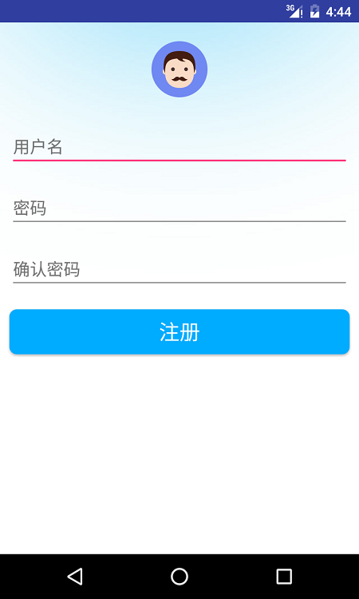
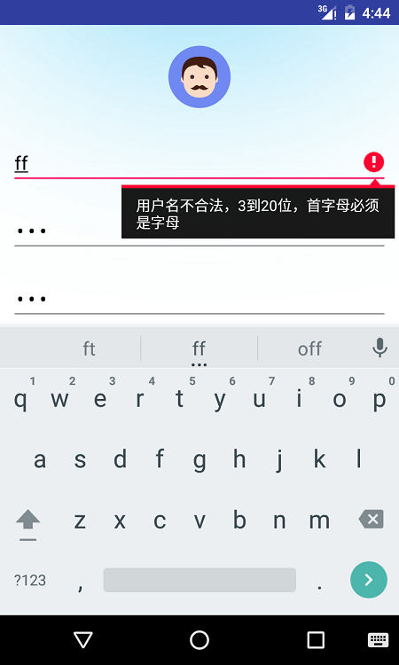

## 功能需求 ##
1. 用户名的长度必须是3-20位，首字母必须为英文字符，其他字符则除了英文外还可以是数字或者下划线。
2. 密码必须是3-20位的数字。
3. 密码和确认密码一致

## 正则表达式 ##
[正则表达式-元字符](http://www.runoob.com/regexp/regexp-metachar.html)

	private static final String USER_NAME_REGEX = "^[a-zA-Z]\\w{2,19}$";
    private static final String PASSWORD_REGEX = "^[0-9]{3,20}$";

* \w 匹配包括下划线的任何单词字符。等价于'[A-Za-z0-9_]'。

## MVP实现 ##
* RegisterView
* RegisterPresenter

## 注册流程 ##
1. 实际项目中，注册会将用户名和密码注册到APP的服务器，然后APP的服务器再通过REST API方式注册到环信服务器。
2. 由于本项目没有APP服务器，会将用户数据注册到第三方云数据库Bmob，注册成功后，在客户端发送请求注册到环信服务器。

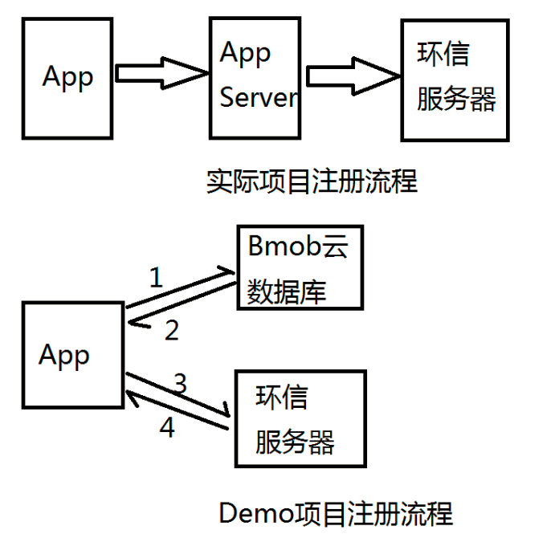

## 云数据库 ##
* [LeanCloud](https://leancloud.cn/)
* [Bmob](http://www.bmob.cn/)
* [Parse](https://parse.com/)(2017年1月28日关闭)

## Bmob集成 ##
[开发文档](http://docs.bmob.cn/data/Android/b_developdoc/doc/index.html)

1. 注册创建应用
2. 下载SDK
3. 导入SDK
4. 初始化SDk

## 隐藏软键盘 ##

	protected void hideSoftKeyboard() {
        if (mInputMethodManager == null) {
            mInputMethodManager = (InputMethodManager) getSystemService(INPUT_METHOD_SERVICE);
        }
        mInputMethodManager.hideSoftInputFromWindow(getCurrentFocus().getWindowToken(), 0);
    }

## 软键盘Action处理 ##

    private TextView.OnEditorActionListener mOnEditorActionListener = new TextView.OnEditorActionListener() {
        @Override
        public boolean onEditorAction(TextView v, int actionId, KeyEvent event) {
            if (actionId == EditorInfo.IME_ACTION_GO) {
                reigister();//注册
                return true;
            }
            return false;
        }
    };

## 用户名已注册的处理 ##
[Bmob错误码](http://docs.bmob.cn/data/Android/g_errorcode/doc/index.html)

# 主界面 #
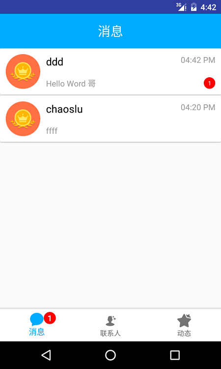

## 底部导航条 ##
RadioGroup, TabHost, FragmentTabHost, 自定义
## 第三方底部条 ##
* [BottomBar](https://github.com/roughike/BottomBar)
* [AHBottomNavigation](https://github.com/aurelhubert/ahbottomnavigation)
* [BottomNavigation](https://github.com/Ashok-Varma/BottomNavigation)
## Fragment的切换 ##

# 动态界面 #
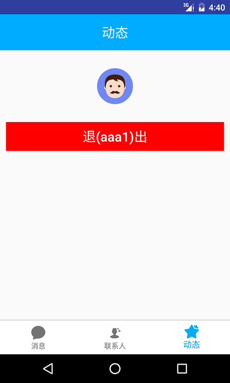

# 联系人界面 #
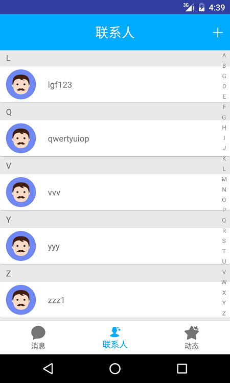
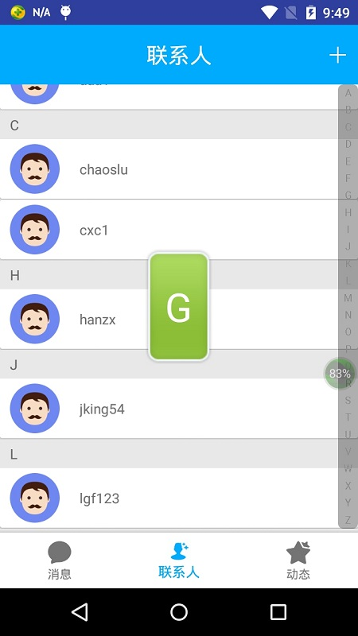

# MVP实现 #
* ContactView
* ContactPresenter

## RecyclerView的使用 ##
[Creating Lists and Cards](https://developer.android.com/training/material/lists-cards.html#RecyclerView)

## 联系人是否在同一个组 ##

    private boolean itemInSameGroup(int i, ContactItem item) {
        return i > 0 && (item.getFirstLetter() == mContactItems.get(i - 1).getFirstLetter());
    }

## CardView的使用 ##

## SwipeRefreshLayout的使用 ##
	mSwipeRefreshLayout.setColorSchemeResources(R.color.qq_blue, R.color.qq_red);
	mSwipeRefreshLayout.setOnRefreshListener(mOnRefreshListener);

## 自定义控件SlideBar ##
### 分类字符数组（供拷贝） ###
    private static final String[] SECTIONS = {"A", "B", "C", "D", "E", "F", "G", "H", "I", "J", "K", "L"
            , "M", "N", "O", "P", "Q", "R", "S", "T", "U", "V", "W", "X", "Y", "Z"};
### 绘制居中文本 ###
http://www.cnblogs.com/tianzhijiexian/p/4297664.html

### 在ContactFragment里面监听SlideBar的事件 ###
    private SlideBar.OnSlideBarChangeListener mOnSlideBarChangeListener = new SlideBar.OnSlideBarChangeListener() {
        @Override
        public void onSectionChange(int index, String section) {
            mSection.setVisibility(View.VISIBLE);
            mSection.setText(section);
            scrollToSection(section);
        }

        @Override
        public void onSlidingFinish() {
            mSection.setVisibility(View.GONE);
        }
    };

    /**
     * RecyclerView滚动直到界面出现对应section的联系人
     * 
     * @param section 首字符
     */
    private void scrollToSection(String section) {
        int sectionPosition = getSectionPosition(section);
        if (sectionPosition != POSITION_NOT_FOUND) {
            mRecyclerView.smoothScrollToPosition(sectionPosition);
        }
    }

    /**
     * 
     * @param section 首字符
     * @return 在联系人列表中首字符是section的第一个联系人在联系人列表中的位置
     */
    private int getSectionPosition(String section) {
        List<ContactItem> contactItems = mContactListAdapter.getContactItems();
        for (int i = 0; i < contactItems.size(); i++) {
            if (section.equals(contactItems.get(i).getFirstLetterString())) {
                return i;
            }
        }
        return POSITION_NOT_FOUND;
    }

## 联系人点击事件 ##
    private ContactListAdapter.OnItemClickListener mOnItemClickListener = new ContactListAdapter.OnItemClickListener() {

        /**
         * 单击跳转到聊天界面
         * @param name 点击item的联系人名字
         */
        @Override
        public void onItemClick(String name) {
            startActivity(ChatActivity.class, Constant.Extra.USER_NAME, name);
        }

        /**
         * 长按删除好友
         * @param name 点击item的联系人名字
         */
        @Override
        public void onItemLongClick(final String name) {
            AlertDialog.Builder builder = new AlertDialog.Builder(getContext());
            String message = String.format(getString(R.string.delete_friend_message), name);
            builder.setTitle(getString(R.string.delete_friend))
                    .setMessage(message)
                    .setNegativeButton(getString(R.string.cancel), new DialogInterface.OnClickListener() {
                        @Override
                        public void onClick(DialogInterface dialog, int which) {
                            dialog.dismiss();
                        }
                    })
                    .setPositiveButton(getString(R.string.confirm), new DialogInterface.OnClickListener() {
                        @Override
                        public void onClick(DialogInterface dialog, int which) {
                            dialog.dismiss();
                            showProgress(getString(R.string.deleting_friend));
                            mContactPresenter.deleteFriend(name);

                        }
                    });
            builder.show();
        }
    };

# 添加好友界面 #
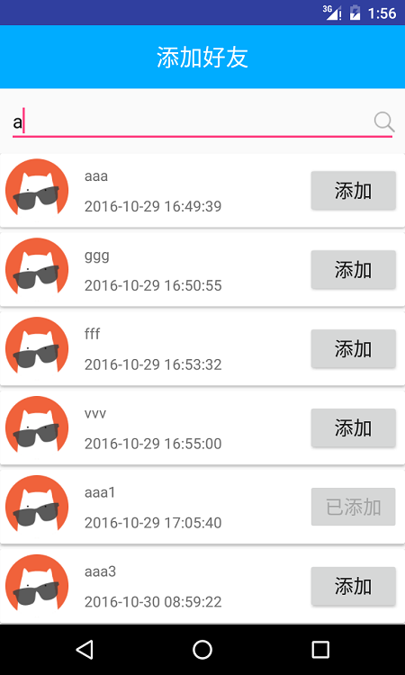

## 搜索用户 ##
[查询数据](http://docs.bmob.cn/data/Android/b_developdoc/doc/index.html#查询数据)

    @Override
    public void searchFriend(final String keyword) {
        mAddFriendView.onStartSearch();
        //注:模糊查询只对付费用户开放，付费后可直接使用。
        BmobQuery<User> query = new BmobQuery<User>();
        query.addWhereContains("username", keyword).addWhereNotEqualTo("username", EMClient.getInstance().getCurrentUser());
        query.findObjects(new FindListener<User>() {
            @Override
            public void done(List<User> list, BmobException e) {
                processResult(list, e);
            }
        });
    }

## greenDAO ##
greenDAO是Android SQLite数据库ORM框架的一种。ORM即对象关系映射, object/relational mapping, 将Java对象映射成数据库的表。

### 其他ORM框架 ###
* [DBFlow](https://github.com/Raizlabs/DBFlow)
* [Ormlite](http://ormlite.com/)
* [Sugar](http://satyan.github.io/sugar/)
* [ActiveAndroid](https://github.com/pardom/ActiveAndroid)
* [Sprinkles](https://github.com/emilsjolander/sprinkles)
* [Ollie](https://github.com/pardom/ollie/)

### 参考 ###
* [Github](https://github.com/greenrobot/greenDAO)
* [官网](http://greenrobot.org/greendao/)
* [AppBrain](http://www.appbrain.com/stats/libraries/details/greendao/greendao)
* [使用文档](http://greenrobot.org/greendao/documentation/)
* [中文使用文档](http://www.jianshu.com/p/2f7f48563141)

### 创建实体类 ###
	@Entity
	public class Contact {
	
	    @Id
	    public Long id;
	
	    public String userName;
	}

### 初始化 ###
    public void init(Context context) {
        DaoMaster.DevOpenHelper devOpenHelper = new DaoMaster.DevOpenHelper(context, Constant.Database.DATABASE_NAME, null);
        SQLiteDatabase writableDatabase = devOpenHelper.getWritableDatabase();
        DaoMaster daoMaster = new DaoMaster(writableDatabase);
        mDaoSession = daoMaster.newSession();
    }

### 保存联系人 ###
    public void saveContact(String userName) {
        Contact contact = new Contact();
        contact.setUsername(userName);
        mDaoSession.getContactDao().save(contact);
    }

### 查询联系人 ###
    public List<String> queryAllContacts() {
        List<Contact> list = mDaoSession.getContactDao().queryBuilder().list();
        ArrayList<String> contacts = new ArrayList<String>();
        for (int i = 0; i < list.size(); i++) {
            String contact = list.get(i).getUsername();
            contacts.add(contact);
        }
        return contacts;
    }

### 删除联系人 ###
    public void deleteAllContacts() {
        ContactDao contactDao = mDaoSession.getContactDao();
        contactDao.deleteAll();
    }

## 发送好友请求 ##
### AddFriendItemView里面处理点击事件 ###
    @OnClick(R.id.add)
    public void onClick() {
        String friendName = mUserName.getText().toString().trim();
        String addFriendReason = getContext().getString(R.string.add_friend_reason);
        AddFriendEvent event = new AddFriendEvent(friendName, addFriendReason);
        EventBus.getDefault().post(event);
    }

### AddFriendPresenterImpl实现发送好友请求  ###
    @Subscribe(threadMode = ThreadMode.BACKGROUND)
    public void addFriend(AddFriendEvent event) {
        try {
            EMClient.getInstance().contactManager().addContact(event.getFriendName(), event.getReason());
            ThreadUtils.runOnUiThread(new Runnable() {
                @Override
                public void run() {
                    mAddFriendView.onAddFriendSuccess();
                }
            });
        } catch (HyphenateException e) {
            e.printStackTrace();
            ThreadUtils.runOnUiThread(new Runnable() {
                @Override
                public void run() {
                    mAddFriendView.onAddFriendFailed();
                }
            });
        }

### 在联系人列表中监听联系人变化 ###
    private EMContactListenerAdapter mEMContactListener = new EMContactListenerAdapter() {

        @Override
        public void onContactAdded(String s) {
            mContactPresenter.refreshContactList();
        }

        @Override
        public void onContactDeleted(String s) {
            mContactPresenter.refreshContactList();
        }
    };

# 聊天界面 #
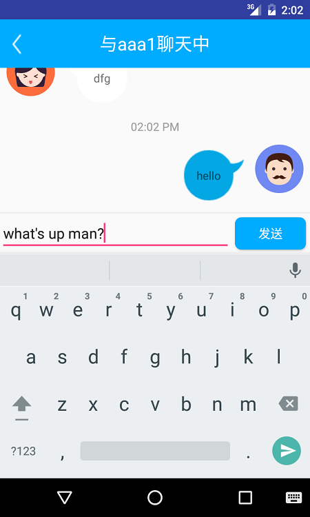

### 监听发送按钮的状态变化 ###
    mEdit.addTextChangedListener(mTextWatcher);
    private TextWatcherAdapter mTextWatcher = new TextWatcherAdapter() {
        @Override
        public void afterTextChanged(Editable s) {
            mSend.setEnabled(s.length() != 0);
        }
    };

### 动画文件 ###
* anim文件夹：存放补间动画
* animator文件夹：存放属性动画
* drawable文件夹：存放帧动画

### 发送消息的进度动画 ###
	<?xml version="1.0" encoding="utf-8"?>
	<animation-list xmlns:android="http://schemas.android.com/apk/res/android">
	    <item android:drawable="@mipmap/loading1" android:duration="100"/>
	    <item android:drawable="@mipmap/loading2" android:duration="100"/>
	    <item android:drawable="@mipmap/loading3" android:duration="100"/>
	    <item android:drawable="@mipmap/loading4" android:duration="100"/>
	    <item android:drawable="@mipmap/loading5" android:duration="100"/>
	    <item android:drawable="@mipmap/loading6" android:duration="100"/>
	    <item android:drawable="@mipmap/loading7" android:duration="100"/>
	    <item android:drawable="@mipmap/loading8" android:duration="100"/>
	</animation-list>

### .9文件制作 ###
[官方说明](https://developer.android.com/guide/topics/graphics/2d-graphics.html#nine-patch)

## 发送一条消息 ##

### 返回消息的类型 ###
    @Override
    public int getItemViewType(int position) {
        EMMessage message = mMessages.get(position);
        return message.direct() == EMMessage.Direct.SEND ? ITEM_TYPE_SEND_MESSAGE : ITEM_TYPE_RECEIVE_MESSAGE;
    }

### 是否显示时间戳的判断 ###
    /**
     * 如果两个消息之间的时间太近，就不显示时间戳
     */
    private boolean shouldShowTimeStamp(int position) {
        long currentItemTimestamp = mMessages.get(position).getMsgTime();
        long preItemTimestamp = mMessages.get(position - 1).getMsgTime();
        boolean closeEnough = DateUtils.isCloseEnough(currentItemTimestamp, preItemTimestamp);
        return !closeEnough;
    }

### 更新消息的状态 ###
    private void updateSendingStatus(EMMessage emMessage) {
        switch (emMessage.status()) {
            case INPROGRESS:
                mSendMessageProgress.setVisibility(VISIBLE);
                mSendMessageProgress.setImageResource(R.drawable.send_message_progress);
                AnimationDrawable drawable = (AnimationDrawable) mSendMessageProgress.getDrawable();
                drawable.start();
                break;
            case SUCCESS:
                mSendMessageProgress.setVisibility(GONE);
                break;
            case FAIL:
                mSendMessageProgress.setImageResource(R.mipmap.msg_error);
                break;
        }
    }

## 接收一条消息 ##
    private EMMessageListenerAdapter mEMMessageListener = new EMMessageListenerAdapter() {
        @Override
        public void onMessageReceived(final List<EMMessage> list) {
            ThreadUtils.runOnUiThread(new Runnable() {
                @Override
                public void run() {
                    final EMMessage emMessage = list.get(0);
                    mChatPresenter.makeMessageRead(mUserName);
                    mMessageListAdapter.addNewMessage(emMessage);
                    smoothScrollToBottom();
                }
            });
        }
    };

## 初始化聊天记录 ##
[官方文档](http://docs.easemob.com/im/200androidclientintegration/50singlechat)

[通信过程及聊天记录保存](http://docs.easemob.com/im/000quickstart/25communicationandmessagestorage)

    @Override
    public void loadMessages(final String userName) {
        ThreadUtils.runOnBackgroundThread(new Runnable() {
            @Override
            public void run() {
                EMConversation conversation = EMClient.getInstance().chatManager().getConversation(userName);
                if (conversation != null) {
                    //获取此会话的所有消息
                    List<EMMessage> messages = conversation.getAllMessages();
                    mEMMessageList.addAll(messages);
                    //指定会话消息未读数清零
                    conversation.markAllMessagesAsRead();
                }
                ThreadUtils.runOnUiThread(new Runnable() {
                    @Override
                    public void run() {
                        mChatView.onMessagesLoaded();
                    }
                });
            }
        });
    }

## 加载更多聊天记录 ##
    @Override
    public void loadMoreMessages(final String userName) {
        if (hasMoreData) {
            ThreadUtils.runOnBackgroundThread(new Runnable() {
                @Override
                public void run() {
                    EMConversation conversation = EMClient.getInstance().chatManager().getConversation(userName);
                    EMMessage firstMessage = mEMMessageList.get(0);
                    //SDK初始化加载的聊天记录为20条，到顶时需要去DB里获取更多
                    //获取startMsgId之前的pagesize条消息，此方法获取的messages SDK会自动存入到此会话中，APP中无需再次把获取到的messages添加到会话中
                    final List<EMMessage> messages = conversation.loadMoreMsgFromDB(firstMessage.getMsgId(), DEFAULT_PAGE_SIZE);
                    hasMoreData = (messages.size() == DEFAULT_PAGE_SIZE);
                    mEMMessageList.addAll(0, messages);
                    ThreadUtils.runOnUiThread(new Runnable() {
                        @Override
                        public void run() {
                            mChatView.onMoreMessagesLoaded(messages.size());
                        }
                    });
                }
            });
        } else {
            mChatView.onNoMoreData();
        }
    }

# 会话界面 #

## MVP实现 ##
* ConversationView
* ConversationPresenter

## 加载所有会话 ##
    @Override
    public void loadAllConversations() {
        ThreadUtils.runOnBackgroundThread(new Runnable() {
            @Override
            public void run() {
                Map<String, EMConversation> conversations = EMClient.getInstance().chatManager().getAllConversations();
                mEMConversations.addAll(conversations.values());
                Collections.sort(mEMConversations, new Comparator<EMConversation>() {
                    @Override
                    public int compare(EMConversation o1, EMConversation o2) {
                        return (int) (o2.getLastMessage().getMsgTime() - o1.getLastMessage().getMsgTime());
                    }
                });
                ThreadUtils.runOnUiThread(new Runnable() {
                    @Override
                    public void run() {
                        mConversationView.onAllConversationsLoaded();
                    }
                });
            }
        });
    }

## 未读消息计数更新 ##
[官方文档](http://docs.easemob.com/im/200androidclientintegration/50singlechat)
### 会话列表中未读消息的更新 ###
    private EMMessageListenerAdapter mEMMessageListenerAdapter = new EMMessageListenerAdapter() {

        @Override
        public void onMessageReceived(List<EMMessage> list) {
            ThreadUtils.runOnUiThread(new Runnable() {
                @Override
                public void run() {
                    toast(getString(R.string.receive_new_message));
                    mConversationPresenter.loadAllConversations();
                }
            });
        }
    };
### BottomBar bardge的更新 ###
    private EMMessageListenerAdapter mEMMessageListenerAdapter = new EMMessageListenerAdapter() {

        //该回调在子线程中调用
        @Override
        public void onMessageReceived(List<EMMessage> list) {
            updateUnreadCount();
        }
    };

    private void updateUnreadCount() {
        ThreadUtils.runOnUiThread(new Runnable() {
            @Override
            public void run() {
                BottomBarTab bottomBar = mBottomBar.getTabWithId(R.id.conversations);
                int count = EMClient.getInstance().chatManager().getUnreadMsgsCount();
                bottomBar.setBadgeCount(count);
            }
        });
    }

## 标记消息已读 ##
### 加载聊天数据时标记已读 ###
	//指定会话消息未读数清零
	conversation.markAllMessagesAsRead();
### 在聊天界面收到新消息时将消息标记已读 ###

### 聊天界面返回时更新未读badge ###
    @Override
    protected void onResume() {
        super.onResume();
        updateUnreadCount();
    }

# 消息通知 #
## 通知 ##
### 判断app是否在前台 ###
    public boolean isForeground() {
        ActivityManager am = (ActivityManager) getSystemService(ACTIVITY_SERVICE);
        List<ActivityManager.RunningAppProcessInfo> runningAppProcesses = am.getRunningAppProcesses();
        if (runningAppProcesses == null) {
            return false;
        }
        for (ActivityManager.RunningAppProcessInfo info :runningAppProcesses) {
            if (info.processName.equals(getPackageName()) && info.importance == ActivityManager.RunningAppProcessInfo.IMPORTANCE_FOREGROUND) {
                return true;
            }
        }
        return false;
    }

### 如果app在后台则弹出Notification ###
    private void showNotification(EMMessage emMessage) {
        String contentText = "";
        if (emMessage.getBody() instanceof EMTextMessageBody) {
            contentText = ((EMTextMessageBody) emMessage.getBody()).getMessage();
        }

        Intent chat = new Intent(this, ChatActivity.class);
        chat.putExtra(Constant.Extra.USER_NAME, emMessage.getUserName());
        PendingIntent pendingIntent = PendingIntent.getActivity(this, 1, chat, PendingIntent.FLAG_UPDATE_CURRENT);

        NotificationManager notificationManager = (NotificationManager) getSystemService(NOTIFICATION_SERVICE);
        Notification notification = new Notification.Builder(this)
                .setLargeIcon(BitmapFactory.decodeResource(getResources(), R.mipmap.avatar1))
                .setSmallIcon(R.mipmap.ic_contact_selected_2)
                .setContentTitle(getString(R.string.receive_new_message))
                .setContentText(contentText)
                .setPriority(Notification.PRIORITY_MAX)
                .setContentIntent(pendingIntent)
                .setAutoCancel(true)
                .build();
        notificationManager.notify(1, notification);
    }

## 声音  ##

### 初始化SoundPool ###
    private void initSoundPool() {
        mSoundPool = new SoundPool(2, AudioManager.STREAM_MUSIC, 0);
        mDuanSound = mSoundPool.load(this, R.raw.duan, 1);
        mYuluSound = mSoundPool.load(this, R.raw.yulu, 1);
    }

### 播放音效 ###
    private EMMessageListenerAdapter mEMMessageListenerAdapter = new EMMessageListenerAdapter() {

        @Override
        public void onMessageReceived(List<EMMessage> list) {
            if (isForeground()) {
                mSoundPool.play(mDuanSound, 1, 1, 0, 0, 1);
            } else {
                mSoundPool.play(mYuluSound, 1, 1, 0, 0, 1);
                showNotification(list.get(0));
            }
        }
    };

# 多设备登录 #
[官方文档](http://docs.easemob.com/im/200androidclientintegration/30androidsdkbasics)

    private EMConnectionListener mEMConnectionListener = new EMConnectionListener() {
        @Override
        public void onConnected() {

        }

        @Override
        public void onDisconnected(int i) {
            if (i == EMError.USER_LOGIN_ANOTHER_DEVICE) {
                ThreadUtils.runOnUiThread(new Runnable() {
                    @Override
                    public void run() {
                        startActivity(LoginActivity.class);
                        toast(getString(R.string.user_login_another_device));
                    }
                });
            }
        }
    };

# License #

	QQDemo
	Copyright (c) 2016 Leon Fan (https://github.com/uncleleonfan).
	
	Licensed under the Apache License, Version 2.0 (the "License");
	you may not use this file except in compliance with the License.
	You may obtain a copy of the License at
	
	http://www.apache.org/licenses/LICENSE-2.0
	
	Unless required by applicable law or agreed to in writing, software
	distributed under the License is distributed on an "AS IS" BASIS,
	WITHOUT WARRANTIES OR CONDITIONS OF ANY KIND, either express or implied.
	See the License for the specific language governing permissions and
	limitations under the License.